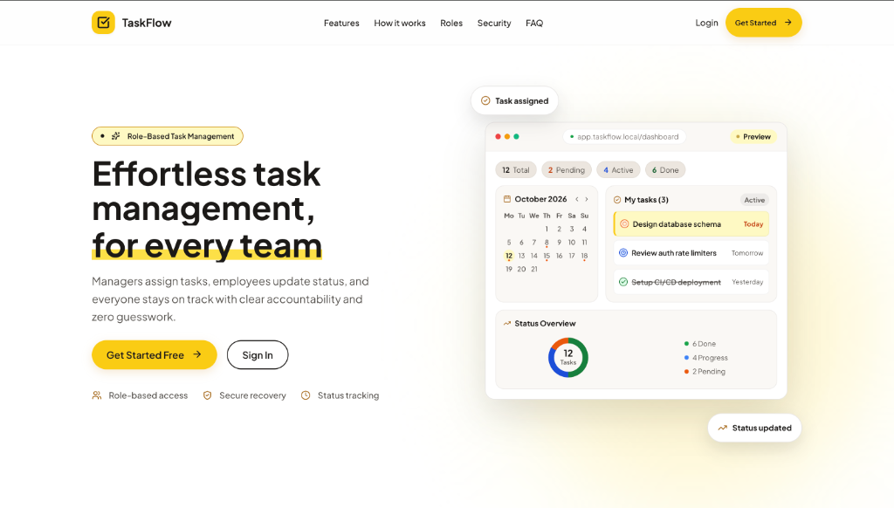
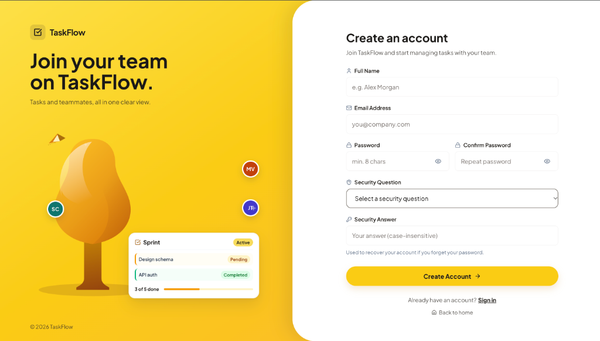
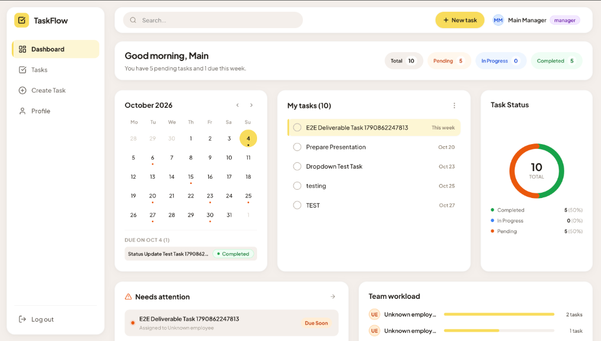
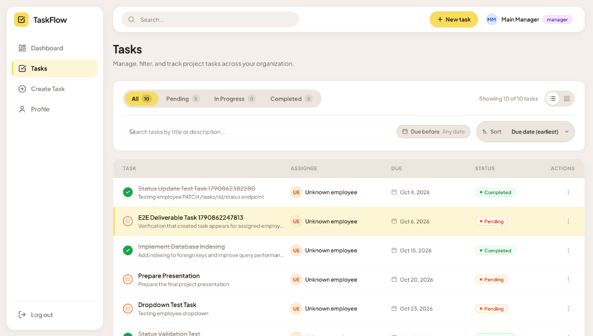
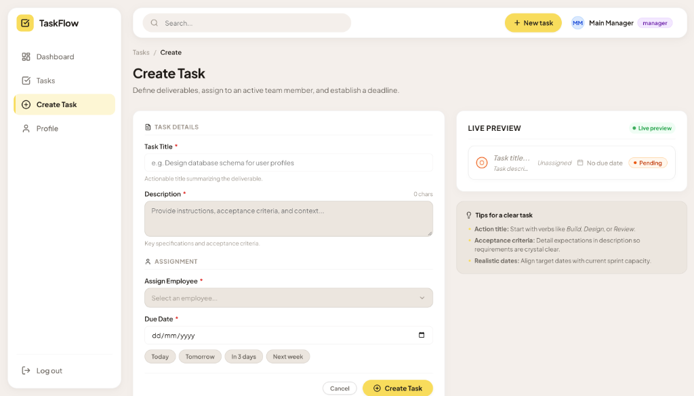
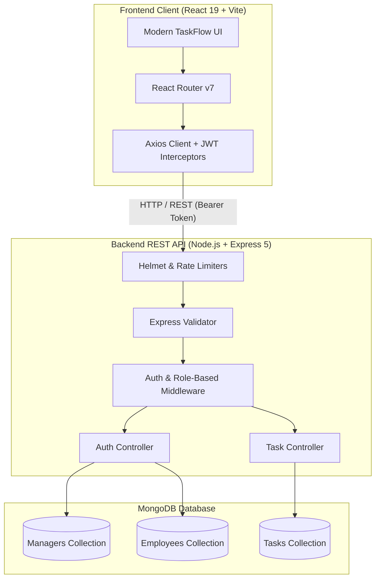

# TaskFlow — Modern Role-Based Task Management System

<p align="center">
  
</p>

<p align="center">
  <strong>Effortless task management, for every team.</strong><br/>
  Managers assign deliverables, employees track and update status, and everyone stays aligned with zero guesswork.
</p>

<p align="center">
  
  
  
  
  
  
</p>

---

## 📑 Table of Contents

- [Overview](#-overview)
- [Key Features](#-key-features)
- [User Interface Showcase](#-user-interface-showcase)
- [System Architecture](#-system-architecture)
- [Tech Stack](#-tech-stack)
- [API Endpoints](#-api-endpoints)
- [Project Structure](#-project-structure)
- [Getting Started](#-getting-started)
  - [Prerequisites](#prerequisites)
  - [Backend Setup](#1-backend-setup)
  - [Frontend Setup](#2-frontend-setup)
  - [Seeding Initial Manager](#3-seed-initial-manager-account)
- [Security Features](#-security-features)
- [Contributing](#-contributing)
- [License](#-license)

---

## 🌟 Overview

**TaskFlow** is a full-stack, role-based task and workflow management platform crafted for modern teams. Built with **React 19**, **Node.js / Express 5**, and **MongoDB**, it bridges the communication gap between managers and employees with real-time transparency, deadlines, interactive status transitions, and actionable visual analytics.

### Why TaskFlow?
- 🎯 **Eliminate Ambiguity**: Clear deliverable titles, detailed acceptance criteria, and specific assignees.
- ⚡ **Streamlined Workflow**: Managers create and supervise tasks while employees own the progress lifecycle (`Pending` ➔ `In Progress` ➔ `Completed`).
- 📊 **Visual Accountability**: Calendar views, donut metrics, workload indicators, and critical "Needs Attention" banners.
- 🔒 **Enterprise-Grade Security**: Security-question recovery, brute-force rate limiters, token expiration, and secure headers.

---

## ✨ Key Features

### 1. 👥 Role-Based Access Control (RBAC)
- **Managers**:
  - Create and delegate tasks to active employees.
  - View overall project progress, task status breakdowns, and team workload distribution.
  - Filter, search, and delete tasks across the entire organization.
  - Provision team members and access employee directory.
- **Employees**:
  - Personalized dashboard showing tasks assigned specifically to them.
  - Update task progress statuses seamlessly (`Pending`, `In Progress`, `Completed`).
  - View calendar milestones and prioritize urgent upcoming tasks.

### 2. 📅 Interactive Calendar & Deadline Tracking
- Embedded monthly calendar highlighting active deliverables and due dates.
- Quick date chips (`Today`, `Tomorrow`, `In 3 days`, `Next week`) for fast task planning.
- "Needs Attention" urgency widgets highlighting approaching deadlines.

### 3. 📊 Visual Dashboard & Live Previews
- **Donut Chart Status Breakdown**: Real-time ratio of Pending, In Progress, and Completed tasks.
- **Team Workload Bars**: Balance assignments across team members to prevent burnout.
- **Live Task Preview Card**: Instant visual card rendering while authoring new tasks.

### 4. 🛡️ Robust Security & Account Recovery
- **JWT Authentication** with HTTP Bearer token headers.
- **Bcrypt Password Hashing** with salted rounds.
- **Self-Service Security Recovery**: Password reset protected by predefined security questions, lockout timers, and strict attempt limits.
- **Express-Validator & Rate Limiting**: Input sanitization and IP-based rate limiting to prevent credential stuffing.

---

## 📸 User Interface Showcase

### 1. Modern Landing Page
A sleek, welcoming entry point highlighting TaskFlow’s core capabilities, workflow explanations, role breakdowns, and quick entry buttons.

<p align="center">
  
</p>

---

### 2. User Registration & Security Question Setup
Intuitive onboarding flow allowing users to sign up and establish a fallback security question for self-service account recovery.

<p align="center">
  
</p>

---

### 3. Comprehensive Manager Dashboard
Centralized command center featuring greeting stats, interactive deadline calendar, quick task lists, donut status analytics, urgency alerts, and team workload bars.

<p align="center">
  
</p>

---

### 4. Tasks Directory & Advanced Filtering
Search deliverables by keyword, filter by lifecycle status (`All`, `Pending`, `In Progress`, `Completed`), and sort dynamically by earliest or latest due dates.

<p align="center">
  
</p>

---

### 5. Create Task with Live Card Preview
Managers can define deliverable titles, acceptance criteria, employee assignees, and deadlines, all while seeing a real-time reactive card preview before submitting.

<p align="center">
  
</p>

---

## 🏛️ System Architecture



---

## 💻 Tech Stack

### Frontend
- **Framework**: [React 19](https://react.dev/)
- **Build Tool**: [Vite 8](https://vitejs.dev/)
- **Routing**: [React Router DOM v7](https://reactrouter.com/)
- **HTTP Client**: [Axios](https://axios-http.com/) (with automatic JWT authorization bearer interceptors)
- **Icons**: [Lucide React](https://lucide.dev/)
- **Styling**: Modern Vanilla CSS Design System (Custom CSS tokens, glassmorphism, responsive cards)

### Backend
- **Runtime**: [Node.js](https://nodejs.org/)
- **Web Framework**: [Express 5](https://expressjs.com/)
- **Database**: [MongoDB](https://www.mongodb.com/) with [Mongoose ODM](https://mongoosejs.com/)
- **Authentication**: [JSON Web Tokens (jsonwebtoken)](https://jwt.io/) & [bcryptjs](https://github.com/dcodeIO/bcrypt.js)
- **Security & Hardening**:
  - [Helmet](https://helmetjs.github.io/) for HTTP security headers
  - [express-rate-limit](https://github.com/express-rate-limit/express-rate-limit) for abuse & brute-force mitigation
  - [express-validator](https://express-validator.github.io/docs/) for strict request payload validation
  - [cors](https://github.com/expressjs/cors) for controlled cross-origin resource sharing

---

## 🔌 API Endpoints

### Authentication & Account Recovery (`/api/auth`)

| Method | Endpoint | Access | Description |
| :--- | :--- | :--- | :--- |
| `POST` | `/api/auth/register` | Public | Register a new user account with security question |
| `POST` | `/api/auth/login` | Public | Authenticate user and return JWT bearer token |
| `POST` | `/api/auth/forgot-password` | Public (Rate-Limited) | Initiate password reset by requesting user security question |
| `POST` | `/api/auth/verify-security-answer` | Public (Rate-Limited) | Validate answer and return temporary reset token |
| `POST` | `/api/auth/reset-password` | Public (Rate-Limited) | Reset account password using verified token |
| `POST` | `/api/auth/create-manager` | Private (Manager) | Create an additional manager account |
| `GET` | `/api/auth/employees` | Private (Manager) | Retrieve directory of all registered employees |

### Task Management (`/api/tasks`)

| Method | Endpoint | Access | Description |
| :--- | :--- | :--- | :--- |
| `POST` | `/api/tasks` | Private (Manager) | Create and assign a new deliverable |
| `GET` | `/api/tasks` | Private (Manager / Employee) | Retrieve tasks (filtered by user role and query parameters) |
| `PATCH` | `/api/tasks/:id/status` | Private (Employee) | Update task lifecycle (`Pending`, `In Progress`, `Completed`) |
| `DELETE`| `/api/tasks/:id` | Private (Manager / Owner) | Delete a task |

---

## 📁 Project Structure

```
task-management-system/
├── backend/
│   ├── config/
│   │   └── db.js                   # MongoDB connection configuration
│   ├── controllers/
│   │   ├── authController.js       # Auth, registration & recovery logic
│   │   ├── taskController.js       # Task CRUD operations
│   │   └── taskStatusController.js # Task status transition handler
│   ├── middleware/
│   │   ├── authMiddleware.js       # JWT extraction & verification
│   │   ├── errorMiddleware.js      # Global error handling middleware
│   │   ├── ownershipMiddleware.js  # Verifies task assignment ownership
│   │   ├── rateLimitMiddleware.js  # Dedicated brute-force rate limiters
│   │   └── roleMiddleware.js       # Role authorization guards (manager/employee)
│   ├── models/
│   │   ├── Employee.js             # Employee Mongoose schema with security fields
│   │   ├── Manager.js              # Manager Mongoose schema
│   │   └── Task.js                 # Task schema (title, status, assignees, dates)
│   ├── routes/
│   │   ├── authRoutes.js           # Auth route declarations & rate limit hooks
│   │   └── taskRoutes.js           # Task management endpoints
│   ├── scripts/
│   │   └── createManager.js        # Seed script for initial manager account
│   ├── validators/
│   │   ├── authValidator.js        # Validation chains for auth requests
│   │   └── taskValidator.js        # Validation chains for task operations
│   ├── .env.example                # Backend environment template
│   ├── package.json
│   └── server.js                   # Express server entry point
│
├── frontend/
│   ├── public/                     # Static assets and favicon
│   ├── src/
│   │   ├── assets/                 # App images, logos, and illustrations
│   │   ├── components/             # Reusable UI components & layouts
│   │   │   ├── auth/               # Auth layouts, illustrations & cards
│   │   │   └── ...                 # Navigation, modals, badges, inputs
│   │   ├── context/                # Auth & global state context providers
│   │   ├── hooks/                  # Custom hooks (data fetching, viewport)
│   │   ├── pages/
│   │   │   ├── Landing.jsx         # Marketing & product landing page
│   │   │   ├── Login.jsx           # Sign in view
│   │   │   ├── Register.jsx        # Account creation & security question setup
│   │   │   ├── ForgotPassword.jsx  # Multi-step password reset flow
│   │   │   ├── Dashboard.jsx       # Interactive analytics & summary dashboard
│   │   │   ├── Tasks.jsx           # Filterable task directory & table
│   │   │   ├── CreateTask.jsx      # Task creator with live reactive card preview
│   │   │   ├── Profile.jsx         # User profile details
│   │   │   └── AccessDenied.jsx    # 403 Forbidden handler
│   │   ├── services/
│   │   │   └── api.js              # Configured Axios client with auth interceptor
│   │   ├── styles/                 # Design system & modular CSS
│   │   ├── App.jsx                 # Routing table & route protection guards
│   │   ├── index.css               # Global CSS variables & typography tokens
│   │   └── main.jsx                # React root mount
│   ├── package.json
│   └── vite.config.js              # Vite configuration
│
└── docs/
    └── screenshots/                # Application preview images used in README
        ├── 01-landing-page.png
        ├── 02-register.png
        ├── 03-dashboard.png
        ├── 04-tasks-list.png
        └── 05-create-task.png
```

---

## 🚀 Getting Started

### Prerequisites
- [Node.js](https://nodejs.org/) (version `v18.0.0` or higher)
- [npm](https://www.npmjs.com/) or `yarn` / `pnpm`
- [MongoDB](https://www.mongodb.com/) running locally or a [MongoDB Atlas](https://www.mongodb.com/cloud/atlas) cloud URI

---

### 1. Backend Setup

1. **Navigate to the backend directory:**
   ```bash
   cd backend
   ```

2. **Install dependencies:**
   ```bash
   npm install
   ```

3. **Configure Environment Variables:**
   Create a `.env` file in the `backend/` folder based on `.env.example`:
   ```bash
   cp .env.example .env
   ```

   Edit `.env` with your values:
   ```env
   PORT=5001
   MONGO_URI=mongodb+srv://<username>:<password>@<cluster>.mongodb.net/<database>?retryWrites=true&w=majority
   JWT_SECRET=your_super_secret_jwt_key_here
   JWT_EXPIRES_IN=1d
   ```

4. **Start the backend server:**
   ```bash
   # Development mode with nodemon:
   npm run dev

   # Production mode:
   npm start
   ```
   *The API will run on `http://localhost:5001`.*

---

### 2. Frontend Setup

1. **Open a new terminal and navigate to the frontend directory:**
   ```bash
   cd frontend
   ```

2. **Install dependencies:**
   ```bash
   npm install
   ```

3. **Start the Vite development server:**
   ```bash
   npm run dev
   ```
   *The application will be accessible at `http://localhost:5173` (or the port indicated by Vite).*

---

### 3. Seed Initial Manager Account

To bootstrap the manager role, run the included seeding script:

```bash
cd backend
node scripts/createManager.js
```

This creates the default manager account:
- **Email**: `testmanager@example.com`
- **Password**: `ManagerPassword123`
- **Role**: `manager`

You can immediately use these credentials to log in, invite or view employees, and create tasks!

---

## 🔒 Security Features

- **Rate Limiting Protection**:
  - Global API rate limiting (500 requests per 15-minute window).
  - Strict limiting on password reset endpoints (`forgotPasswordLimiter`, `verifyAnswerLimiter`, `resetPasswordLimiter`) to block brute-force attempts.
- **Account Lockout on Recovery**:
  - Consecutive failed security answer attempts trigger timed lockouts.
- **Payload Validation**:
  - Comprehensive `express-validator` rules sanitizing emails, passwords, and task schemas.
- **Role-Based Guards**:
  - Both client-side routes and server-side controller middleware enforce strict Manager vs Employee privilege separation.

---

## 🤝 Contributing

Contributions, issues, and feature requests are welcome!

1. Fork the Project
2. Create your Feature Branch (`git checkout -b feature/AmazingFeature`)
3. Commit your Changes (`git commit -m 'Add some AmazingFeature'`)
4. Push to the Branch (`git push origin feature/AmazingFeature`)
5. Open a Pull Request

---

## 📄 License

This project is open-source and available under the [ISC License](LICENSE).
